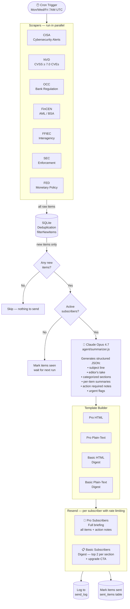
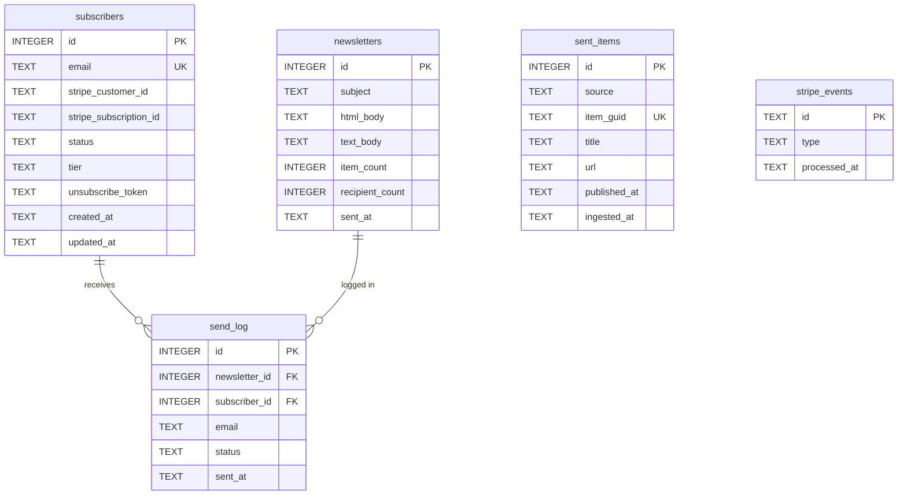
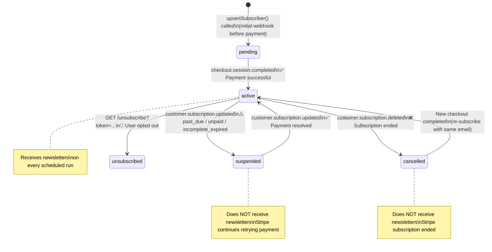

<div align="center">

# FinCompliance Monitor

**Automated regulatory intelligence for financial institutions — delivered three times a week.**

Scrapes seven U.S. government sources, synthesizes them with Claude AI into a prioritized compliance briefing, and delivers personalized newsletters to paying subscribers via Stripe + Resend.

[](https://nodejs.org)
[](https://expressjs.com)
[](https://sqlite.org)
[](https://anthropic.com)
[](https://stripe.com)

</div>

---

## What It Does

FinCompliance Monitor is a complete SaaS newsletter platform that:

1. **Collects** — scrapes CISA cybersecurity advisories, NIST CVEs, OCC bulletins, FinCEN AML/BSA advisories, FFIEC interagency guidance, SEC enforcement actions, and Federal Reserve press releases
2. **Deduplicates** — filters out anything already covered in a prior briefing using a local SQLite database
3. **Synthesizes** — feeds new items to Claude Opus, which writes an analyst-quality compliance briefing in structured JSON
4. **Delivers** — sends personalized HTML newsletters to all active subscribers via Resend, with two content tiers (Pro = full briefing, Basic = digest)
5. **Monetizes** — handles subscriptions, payments, cancellations, and billing events through Stripe Checkout and webhooks

---

## Table of Contents

- [System Architecture](#system-architecture)
- [Data Flow](#data-flow)
- [Data Sources](#data-sources)
- [Database Schema](#database-schema)
- [Subscriber Lifecycle](#subscriber-lifecycle)
- [Email Tiers](#email-tiers)
- [Getting Started](#getting-started)
- [Environment Variables](#environment-variables)
- [Running the Application](#running-the-application)
- [API Reference](#api-reference)
- [Production Deployment](#production-deployment)
- [Security](#security)
- [Revenue Model](#revenue-model)
- [Customization Ideas](#customization-ideas)

---

## System Architecture

The application runs as **two independent Node.js processes** that share a single SQLite database:

```
╔══════════════════════════════════════════════════════════════════════════════╗
║                           FINCOMPLIANCE MONITOR                              ║
╠═══════════════════════════════════╦════════════════════════════════════════╗ ║
║        PROCESS 1: SCHEDULER       ║          PROCESS 2: WEB SERVER         ║ ║
║         node index.js             ║            node server.js              ║ ║
║                                   ║                                        ║ ║
║  ┌──────────────────────────────┐ ║  ┌─────────────────────────────────┐   ║ ║
║  │  node-cron                   │ ║  │  Express.js                     │   ║ ║
║  │  Mon / Wed / Fri @ 7:00 UTC  │ ║  │                                 │   ║ ║
║  └──────────────┬───────────────┘ ║  │  POST /subscribe                │   ║ ║
║                 │                 ║  │  POST /stripe/webhook           │   ║ ║
║                 ▼                 ║  │  GET  /unsubscribe              │   ║ ║
║  ┌──────────────────────────────┐ ║  │  GET  /admin/stats              │   ║ ║
║  │  7 Scrapers (parallel)       │ ║  │  GET  /admin/newsletters        │   ║ ║
║  │  CISA · NVD · OCC · FinCEN  │ ║  │  GET  /health                   │   ║ ║
║  │  FFIEC · SEC · FED           │ ║  └─────────────────────────────────┘   ║ ║
║  └──────────────┬───────────────┘ ║                                        ║ ║
║                 │                 ║  Handles:                               ║ ║
║                 ▼                 ║  • New subscriptions (Stripe Checkout)  ║ ║
║  ┌──────────────────────────────┐ ║  • Cancellations & payment failures     ║ ║
║  │  Deduplication (SQLite)      │ ║  • One-click unsubscribes              ║ ║
║  └──────────────┬───────────────┘ ║  • Admin reporting                     ║ ║
║                 │                 ║                                        ║ ║
║                 ▼                 ╠════════════════════════════════════════╝ ║
║  ┌──────────────────────────────┐ ║                                          ║
║  │  Claude Opus 4.7             │ ║       ┌──────────────────────────┐       ║
║  │  (prompt caching enabled)    │ ║       │    SQLite Database        │       ║
║  └──────────────┬───────────────┘ ║       │    (shared by both)       │       ║
║                 │                 ║       │                            │       ║
║                 ▼                 ║       │  subscribers               │       ║
║  ┌──────────────────────────────┐ ║       │  sent_items                │       ║
║  │  Resend (email delivery)     │ ║       │  newsletters               │       ║
║  │  Pro: full · Basic: digest   │ ║       │  send_log                  │       ║
║  └──────────────────────────────┘ ║       │  stripe_events             │       ║
║                                   ║       └──────────────────────────┘       ║
╚═══════════════════════════════════╩══════════════════════════════════════════╝
```

---

## Data Flow



---

## Data Sources

| Source | Agency | Coverage | Feed Type |
|--------|--------|----------|-----------|
| **CISA** | Cybersecurity & Infrastructure Security Agency | Cybersecurity advisories, ICS/SCADA alerts, known exploited vulnerabilities | RSS |
| **NVD** | NIST National Vulnerability Database | CVEs with CVSS ≥ 7.0 (High + Critical severity), scored vulnerabilities affecting financial-sector software | REST API |
| **OCC** | Office of the Comptroller of the Currency | Bank regulatory guidance, enforcement actions, interpretive letters for national banks | RSS |
| **FinCEN** | Financial Crimes Enforcement Network | AML/BSA advisories, SAR guidance, geographic targeting orders, sanctions-related notices | RSS (2 feeds) |
| **FFIEC** | Federal Financial Institutions Examination Council | Interagency guidance, exam procedures, cybersecurity assessment tools, call report updates | RSS + HTML fallback |
| **SEC** | Securities and Exchange Commission | Enforcement actions, no-action letters, proposed rulemaking affecting broker-dealers and advisers | RSS + HTML fallback |
| **FED** | Federal Reserve System | Monetary policy decisions, supervisory guidance, bank applications, enforcement orders | RSS + HTML fallback |

> **Fallback mechanism:** FFIEC, SEC, and FED scrapers automatically fall back to lightweight HTML parsing if their RSS feed is unavailable, ensuring the pipeline stays resilient to government website outages.

---

## Database Schema



**Key design decisions:**

- `sent_items` uses a `UNIQUE(source, item_guid)` constraint — deduplication is enforced at the database level, not just in application code
- `stripe_events` stores processed webhook event IDs — Stripe retries webhooks on failure, so this table makes the webhook handler fully idempotent
- SQLite runs in **WAL mode** for concurrent read access from both processes without blocking writes
- `unsubscribe_token` is a fresh `crypto.randomBytes(32)` hex string generated on every subscribe/re-subscribe, so old links from cancelled subscriptions are invalidated immediately

---

## Subscriber Lifecycle



---

## Email Tiers

Both tiers receive the same Claude-generated briefing, but with different content depth:

```
┌──────────────────────────────────────────────────────────────────────┐
│                    PRO TIER  ($149/mo)                               │
├──────────────────────────────────────────────────────────────────────┤
│  ⚠️  URGENT BANNER  (if any items flagged urgent)                     │
│                                                                      │
│  ┌─ EDITOR'S TAKE ─────────────────────────────────────────────────┐ │
│  │  3-4 sentence AI-written executive summary of the week's        │ │
│  │  most important themes across all sources                       │ │
│  └─────────────────────────────────────────────────────────────────┘ │
│                                                                      │
│  ┌─ SECTION: Cybersecurity Threats ────────────────────────────────┐ │
│  │  ┌─────────────────────────────────────────────────────────┐    │ │
│  │  │  [CISA]  Advisory Title                                 │    │ │
│  │  │  2-3 sentence summary in plain language                 │    │ │
│  │  │  ┌──────────────────────────────────────────────────┐   │    │ │
│  │  │  │  ACTION REQUIRED  What your team should do       │   │    │ │
│  │  │  └──────────────────────────────────────────────────┘   │    │ │
│  │  │  Read full advisory →                                   │    │ │
│  │  └─────────────────────────────────────────────────────────┘    │ │
│  │  [repeats for all items in section — no cap]                    │ │
│  └─────────────────────────────────────────────────────────────────┘ │
│                                                                      │
│  [Additional sections: Regulatory Updates, AML/BSA, Enforcement...] │
│                                                                      │
│  ┌─ LOOKING AHEAD ─────────────────────────────────────────────────┐ │
│  │  Forward-looking note on what to watch for next period          │ │
│  └─────────────────────────────────────────────────────────────────┘ │
└──────────────────────────────────────────────────────────────────────┘

┌──────────────────────────────────────────────────────────────────────┐
│                   BASIC TIER  ($49/mo)                               │
├──────────────────────────────────────────────────────────────────────┤
│  [Same header, Editor's Take, and section structure]                 │
│                                                                      │
│  ┌─ SECTION: Cybersecurity Threats ────────────────────────────────┐ │
│  │  Top 2 items only — title + summary, no action notes            │ │
│  └─────────────────────────────────────────────────────────────────┘ │
│                                                                      │
│  ┌─ UPGRADE PROMPT ────────────────────────────────────────────────┐ │
│  │  You're on the Basic plan.                                      │ │
│  │  Upgrade to Pro for full briefings and urgent action alerts.    │ │
│  │                              [ Upgrade to Pro → ]               │ │
│  └─────────────────────────────────────────────────────────────────┘ │
└──────────────────────────────────────────────────────────────────────┘
```

Each email includes:
- Personalized one-click unsubscribe link (unique token per subscriber)
- `List-Unsubscribe` and `List-Unsubscribe-Post` headers (RFC 2369 compliant)
- HTML + plain-text multipart (Resend handles MIME encoding)

---

## Getting Started

### Prerequisites

- Node.js 18 or later
- A [Stripe](https://stripe.com) account
- A [Resend](https://resend.com) account with a verified sending domain
- An [Anthropic](https://console.anthropic.com) API key

### Installation

```bash
git clone https://github.com/your-org/fincompliance-monitor.git
cd fincompliance-monitor
npm install
cp env.example .env
```

### Configure External Services

**1. Stripe**

Create a product with two recurring prices in your [Stripe Dashboard](https://dashboard.stripe.com/products):

| Tier | Suggested Price | Description |
|------|----------------|-------------|
| Basic | $49/month | Digest edition — top 2 items per section |
| Pro | $149/month | Full briefing — all items + action required notes |

Then configure a webhook endpoint:

```
URL:     https://yourdomain.com/stripe/webhook
Events:  checkout.session.completed
         customer.subscription.deleted
         customer.subscription.updated
         invoice.payment_failed
```

Copy the **Webhook Signing Secret** (`whsec_...`) into `STRIPE_WEBHOOK_SECRET` in your `.env`.

**2. Resend**

- Verify your sending domain at [resend.com/domains](https://resend.com/domains)
- Create an API key and add it to `RESEND_API_KEY`
- Set `FROM_EMAIL` to an address on your verified domain

**3. NVD API Key (optional but recommended)**

Without a key, the NVD API allows 5 requests per 30 seconds. With a free key (takes ~1 business day to receive), you get 50 requests per 30 seconds.

Request yours at: [nvd.nist.gov/developers/request-an-api-key](https://nvd.nist.gov/developers/request-an-api-key)

---

## Environment Variables

| Variable | Required | Default | Description |
|----------|----------|---------|-------------|
| `ANTHROPIC_API_KEY` | ✅ | — | Anthropic API key (`sk-ant-...`) |
| `RESEND_API_KEY` | ✅ | — | Resend API key (`re_...`) |
| `FROM_EMAIL` | ✅ | — | Verified sender address (e.g. `briefings@yourdomain.com`) |
| `STRIPE_SECRET_KEY` | ✅ | — | Stripe secret key (`sk_live_...` or `sk_test_...`) |
| `STRIPE_WEBHOOK_SECRET` | ✅ | — | Stripe webhook signing secret (`whsec_...`) |
| `STRIPE_PRICE_ID_BASIC` | ✅ | — | Stripe price ID for Basic tier (`price_...`) |
| `STRIPE_PRICE_ID_PRO` | ⬜ | — | Stripe price ID for Pro tier (`price_...`) |
| `ADMIN_SECRET_KEY` | ⬜ | — | Secret for `/admin/*` endpoints — set a strong random value |
| `FROM_NAME` | ⬜ | `FinCompliance Monitor` | Display name for the sender |
| `APP_URL` | ⬜ | `http://localhost:PORT` | Public base URL (used in unsubscribe links and emails) |
| `PORT` | ⬜ | `3000` | HTTP port for the web server |
| `DB_PATH` | ⬜ | `./compliance.db` | Path to the SQLite database file |
| `CRON_SCHEDULE` | ⬜ | `0 7 * * 1,3,5` | Cron expression for the newsletter schedule |
| `NVD_API_KEY` | ⬜ | — | NIST NVD API key — increases rate limits |
| `NODE_ENV` | ⬜ | — | Set to `production` to enable HSTS headers |
| `TRUST_PROXY` | ⬜ | — | Set to `true` if behind a reverse proxy (nginx, Caddy) |

> **Security note:** Never commit `.env` to version control. The `.gitignore` excludes it. Rotate `ADMIN_SECRET_KEY` and Stripe keys if they are ever exposed.

---

## Running the Application

### Development

Run both processes in separate terminal tabs:

```bash
# Terminal 1 — web server (Stripe webhooks, subscriptions)
npm run server
# or with hot reload:
npm run dev:server

# Terminal 2 — newsletter scheduler
npm start
# or with hot reload:
npm run dev:scheduler
```

To immediately trigger the full pipeline (useful for testing):

```bash
node index.js --now
```

### Adding a Subscriber Manually (for testing)

```javascript
// scripts/add-subscriber.js
require('dotenv').config();
const { upsertSubscriber } = require('./db/database');

upsertSubscriber({
  email:  'you@example.com',
  status: 'active',
  tier:   'basic',   // or 'pro'
});
console.log('Subscriber added.');
```

```bash
node scripts/add-subscriber.js
```

### Cron Schedule Reference

The `CRON_SCHEDULE` variable accepts any valid cron expression:

| Expression | Meaning |
|-----------|---------|
| `0 7 * * 1,3,5` | Mon/Wed/Fri at 7:00 AM UTC *(default)* |
| `0 8 * * 1-5` | Every weekday at 8:00 AM UTC |
| `0 9 * * 1` | Every Monday at 9:00 AM UTC |
| `0 6 * * *` | Every day at 6:00 AM UTC |

---

## API Reference

### Public Endpoints

#### `POST /subscribe`

Creates a Stripe Checkout session for a new subscriber.

```http
POST /subscribe
Content-Type: application/json
Rate-limit: 5 requests / minute per IP

{
  "email": "user@example.com",
  "tier": "basic"   // or "pro"
}
```

**Response:**
```json
{
  "checkoutUrl": "https://checkout.stripe.com/..."
}
```

Redirect the user to `checkoutUrl` to complete payment. After payment, Stripe fires a webhook that activates the subscription automatically.

---

#### `POST /stripe/webhook`

Stripe webhook endpoint. **Do not call this manually.** Requires a valid `Stripe-Signature` header.

Handled events:

| Event | Action |
|-------|--------|
| `checkout.session.completed` | Creates or reactivates subscriber, sets tier |
| `customer.subscription.deleted` | Sets status to `cancelled` |
| `customer.subscription.updated` | Suspends on payment delinquency; reactivates when resolved |
| `invoice.payment_failed` | Logs warning |

All events are idempotent — duplicate deliveries from Stripe are safely ignored.

---

#### `GET /unsubscribe?token=<token>`

One-click unsubscribe. The `token` is embedded in every outgoing email footer. Returns an HTML confirmation page.

---

#### `GET /health`

Returns server status. Useful for uptime monitoring.

```json
{ "status": "ok", "timestamp": "2026-05-23T07:00:00.000Z" }
```

---

### Admin Endpoints

All admin endpoints require the `X-Admin-Key` header set to your `ADMIN_SECRET_KEY`.

#### `GET /admin/stats`

```json
{
  "activeSubscribers": 42,
  "tiers": { "basic": 30, "pro": 12 },
  "timestamp": "2026-05-23T07:00:00.000Z"
}
```

#### `GET /admin/newsletters?limit=20`

Returns recent newsletter metadata (subject, item count, recipient count, sent timestamp). Does not return full HTML bodies.

```json
{
  "newsletters": [
    {
      "id": 17,
      "subject": "FinCompliance Briefing: May 21-23 — 3 Urgent CVEs, New FinCEN Advisory",
      "item_count": 24,
      "recipient_count": 42,
      "sent_at": "2026-05-23T07:04:12"
    }
  ]
}
```

---

## Production Deployment

### Option A — VPS (DigitalOcean, Hetzner, Linode)

```bash
# Install PM2
npm install -g pm2

# Start both processes
pm2 start server.js    --name "compliance-server"
pm2 start index.js     --name "compliance-scheduler"

# Persist across reboots
pm2 save
pm2 startup

# View logs
pm2 logs compliance-server
pm2 logs compliance-scheduler
```

Pair with **nginx** as a reverse proxy with TLS (Certbot/Let's Encrypt):

```nginx
server {
    listen 443 ssl;
    server_name yourdomain.com;

    location / {
        proxy_pass         http://127.0.0.1:3000;
        proxy_set_header   Host $host;
        proxy_set_header   X-Forwarded-For $proxy_add_x_forwarded_for;
        proxy_set_header   X-Forwarded-Proto $scheme;
    }
}
```

Set `TRUST_PROXY=true` and `NODE_ENV=production` in your `.env` when running behind nginx.

### Option B — Railway / Render

Add a `Procfile` to the project root:

```
web:    node server.js
worker: node index.js
```

Set all environment variables in the platform dashboard. Railway and Render both support multiple processes via a `Procfile`.

### Database Backups

The SQLite database is a single file (`compliance.db`). Back it up with:

```bash
# Safe online backup (WAL mode — no lock needed)
sqlite3 compliance.db ".backup compliance-backup-$(date +%Y%m%d).db"
```

Automate with a daily cron job or use [Litestream](https://litestream.io) for continuous replication to S3.

---

## Security

The following security controls are implemented:

| Control | Details |
|---------|---------|
| **Stripe webhook verification** | Every webhook request is verified with `stripe.webhooks.constructEvent` using HMAC-SHA256 before any processing |
| **Webhook idempotency** | Processed event IDs are stored in `stripe_events`; duplicate Stripe deliveries are silently skipped |
| **Timing-safe admin auth** | Admin key comparison uses `crypto.timingSafeEqual` via HMAC to prevent timing oracle attacks |
| **Security headers** | Every response includes `X-Content-Type-Options`, `X-Frame-Options: DENY`, `Referrer-Policy`, `Content-Security-Policy`, `Permissions-Policy`, and HSTS (in production) |
| **Rate limiting** | `/subscribe` and `/unsubscribe` are limited to 5 requests/minute per IP |
| **Token rotation** | Unsubscribe tokens are regenerated on every subscribe/re-subscribe, invalidating old links |
| **Input validation** | Email addresses validated with regex and length-checked (max 254 chars) before touching Stripe |
| **Body size limits** | JSON and URL-encoded bodies capped at 16 KB |
| **URL sanitization** | All URLs in HTML templates are validated to `http:`/`https:` only; text-template URLs are stripped of control characters |
| **Proxy trust** | `X-Forwarded-For` is only trusted when `TRUST_PROXY=true` is explicitly set |
| **Secret management** | `.env` is gitignored; `X-Powered-By` header is suppressed |
| **SQL injection** | All database queries use parameterized statements via `better-sqlite3` — no string interpolation |

---

## Revenue Model

| Tier | Price | Margin |
|------|-------|--------|
| Basic | $49/month | ~99% (fixed infra cost ~$15/mo) |
| Pro | $149/month | ~99% |

**Unit economics at scale:**

| Subscribers | MRR (Basic) | MRR (Pro) | Combined |
|-------------|------------|----------|---------|
| 10 | $490 | $1,490 | $1,980 |
| 50 | $2,450 | $7,450 | $9,900 |
| 100 | $4,900 | $14,900 | $19,800 |

**Marginal cost per additional subscriber ≈ $0** — Claude token costs scale with items (not subscribers), Resend pricing is fractions of a cent per email, and SQLite handles hundreds of concurrent subscribers on a $10/mo VPS.

**Break-even:** 1 Basic subscriber covers hosting costs. 3 subscribers make it cash-flow positive.

---

## Customization Ideas

**Content & Delivery**
- Add additional sources: FDIC enforcement orders, OFR financial stability reports, state banking regulators
- Instant alert emails for CVSS ≥ 9.0 "critical-only" CVEs (separate from the scheduled briefing)
- Keyword filtering per subscriber — allow Pro users to opt into specific topic areas
- Archive past briefings as static HTML pages for a subscriber-only web portal

**Business**
- White-label the platform for a specific bank or credit union (custom domain, logo, sources)
- Add an annual billing option (2 months free) via Stripe's coupon system
- Trial tier: 14-day free access with credit card required (Stripe trial periods)
- Referral program using Stripe customer metadata

**Infrastructure**
- Slack or Microsoft Teams delivery as an alternative to email (Resend → webhook)
- Export to S3/R2 for long-term briefing archival
- Prometheus metrics endpoint for monitoring pipeline health
- [Litestream](https://litestream.io) for continuous SQLite replication to S3
